# HCC Plan DB Playground - Produktanforderungs-Dokument (PRD)

**Version:** 1.0  
**Datum:** 24. August 2025  
**Erstellt für:** Thomas Bomblies  
**Projektstatus:** Production-Ready mit kontinuierlicher Weiterentwicklung  

---

## 🎯 Executive Summary

HCC Plan DB Playground ist eine hochentwickelte, constraint-basierte Einsatzplanungssoftware für mittelständische Unternehmen mit freiberuflichen Mitarbeitern. Die Anwendung kombiniert fortschrittliche Optimierungsalgorithmen (Google OR-Tools) mit einer benutzerfreundlichen PySide6-GUI und einer robusten Datenbankarchitektur, um komplexe Planungsherausforderungen automatisiert zu lösen.

**Kernwertversprechen:**
- Automatisierte Einsatzplanung mit über 20 verschiedenen Constraint-Typen
- Intuitive GUI mit Dark-Mode, Mehrsprachigkeit und erweitertem Help-System
- Enterprise-Grade-Architektur mit Command Pattern, Type Safety und umfassendem Testing
- Google Calendar Integration für nahtlosen Workflow
- Hochentwickelte Excel-Integration für Import/Export-Operationen

---

## 📋 Perspektive 1: Software-Architekt

### Gesamtarchitektur

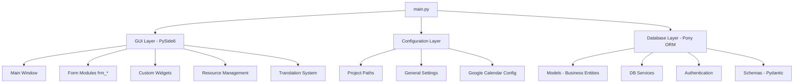
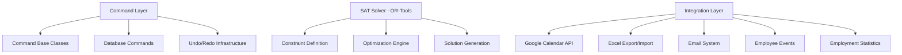

### Architectural Patterns

#### 1. **Layered Architecture (Schichtenarchitektur)**
- **Presentation Layer:** GUI mit PySide6 (MVC Pattern)
- **Business Logic Layer:** Commands und Services
- **Data Access Layer:** Pony ORM mit Repository Pattern
- **Infrastructure Layer:** Configuration, Logging, External APIs

#### 2. **Command Pattern (CQRS-ähnlich)**
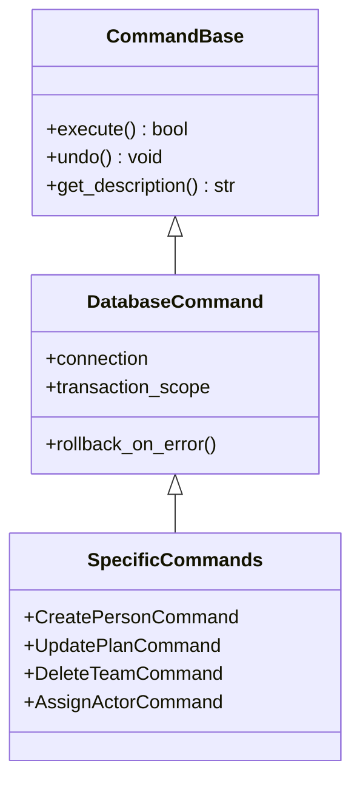

#### 3. **Domain-Driven Design Elemente**
- **Entities:** Person, Project, Team, Plan, PlanPeriod
- **Value Objects:** Address, TimeOfDay, Skills, Flags
- **Aggregates:** Plan als Aggregate Root mit Appointments
- **Domain Services:** SAT Solver für komplexe Geschäftslogik

### Constraint-Solving-Architektur

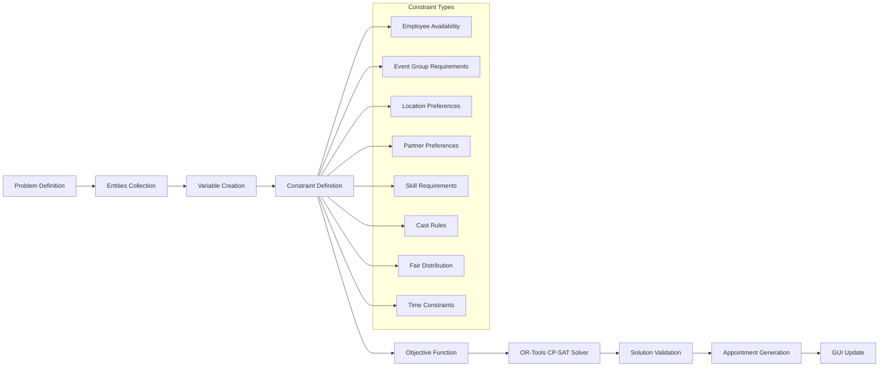

### Datenmodell-Architektur

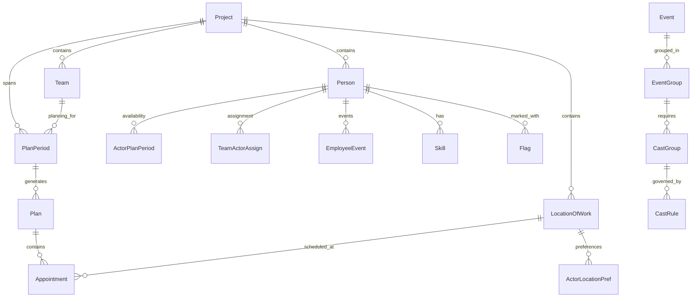

### Technologiestack-Entscheidungen

#### **GUI Framework: PySide6 (Qt6)**
- **Begründung:** Enterprise-Grade GUI mit nativer Performance
- **Vorteile:** Rich Widget-Set, Internationalization, Threading Support
- **Integration:** Custom Widgets, Dark Mode, Resource Management

#### **ORM: Pony ORM**
- **Begründung:** Pythonische Syntax, automatische Query-Optimierung
- **Vorteile:** ACID-Transaktionen, Type Safety, Query-Generator
- **Integration:** Entity-basierte Modellierung, Composite Keys

#### **Constraint Solver: Google OR-Tools CP-SAT**
- **Begründung:** State-of-the-Art Constraint-Programming
- **Vorteile:** NP-Hard-Problem-Lösung, Skalierbarkeit, Optimality
- **Integration:** Custom Objective Functions, Multi-Stage Solving

#### **Validation: Pydantic v2**
- **Begründung:** Runtime Type Checking, Serialization
- **Vorteile:** Error Handling, Schema Evolution, Performance
- **Integration:** API Contracts, Configuration Validation

### Qualitätsattribute

#### **Performanz**
- **Multi-Threading:** Solver läuft in separatem Thread
- **Lazy Loading:** Pony ORM optimierte Queries
- **Caching:** Configuration und Template Caching
- **Batch Operations:** Multi-Selection für UI-Operationen

#### **Skalierbarkeit**
- **Horizontal:** Multi-Project-Support
- **Vertikal:** Constraint-Solver skaliert mit Problemgröße
- **Data:** SQLite für Single-User, Migration zu PostgreSQL möglich

#### **Maintainability**
- **Type Safety:** Vollständige Type Hints
- **Documentation:** Deutsche Kommentare, Memory-System
- **Testing:** pytest-Suite mit Fixtures
- **Logging:** Umfassendes Logging-System mit Crash-Analysis

#### **Security**
- **Authentication:** JWT mit bcrypt Password Hashing
- **Authorization:** Role-based Access Control
- **Data Protection:** Soft-Delete Pattern für Audit-Trail
- **Validation:** Input Sanitization mit Pydantic

---

## 💻 Perspektive 2: Software-Developer

### Code-Qualität und Entwicklungsstandards

#### **Type Safety Implementation**
```python
# Beispiel: Strikte Type Hints in Business Logic
def create_plan_optimized(
    plan_period: PlanPeriod,
    constraints: List[ConstraintDefinition],
    optimization_params: OptimizationConfig
) -> Tuple[Plan, List[Appointment], SolverMetrics]:
    pass
```

#### **Error Handling Strategy**
```python
# Umfassendes Exception Handling
@safe_execute_wrapper
def critical_operation() -> Result[Success, DatabaseError]:
    try:
        with db_session:
            # Critical business logic
            return Success(result)
    except Exception as e:
        logger.error(f"Operation failed: {e}")
        return DatabaseError(str(e))
```

### GUI-Entwicklung: Modulare Architektur

#### **Form-basierte Architektur**
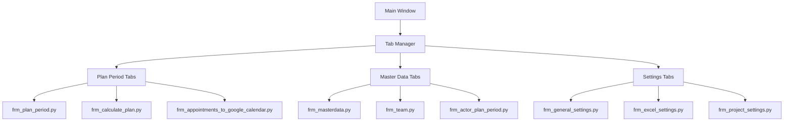

#### **Custom Widget-Entwicklung**
- **TreeWidget-Erweiterungen:** Multi-Selection Drag&Drop
- **Splash Screen:** Loading-Animation mit Progress-Feedback
- **Tab-Widget-Extensions:** Dynamic Tab Management
- **Date-Time-Widgets:** Specialized Time-of-Day Selection

### Command Pattern Implementation

#### **Command Infrastructure**
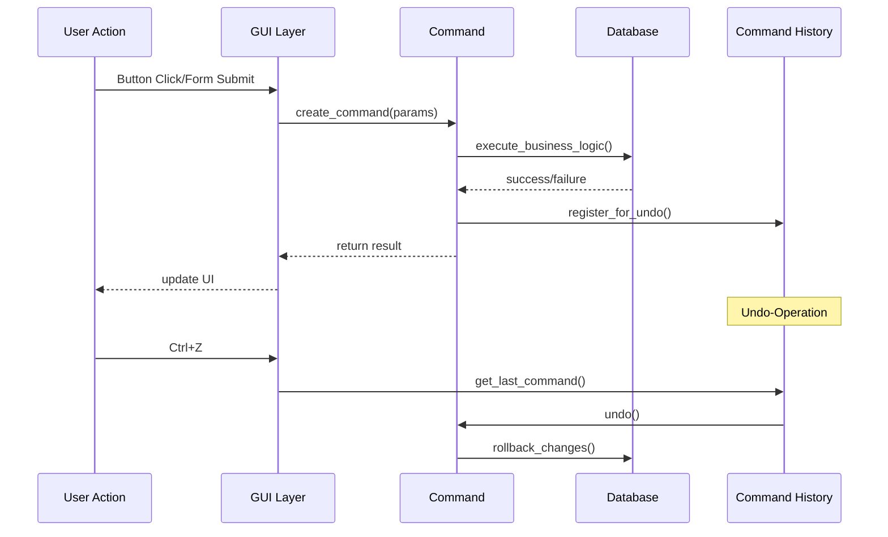

#### **Database Command Categories**
- **CRUD Operations:** Create, Read, Update, Delete für alle Entities
- **Bulk Operations:** Multi-Selection Operations, Batch Updates
- **Complex Operations:** Plan Generation, Constraint Application
- **Migration Commands:** Schema Evolution, Data Migration

### SAT-Solver Integration: Constraint Programming

#### **Solver Architecture**
```python
class SolverEngine:
    def __init__(self):
        self.model = cp_model.CpModel()
        self.solver = cp_model.CpSolver()
        
    def create_variables(self, entities: Entities) -> Dict[str, IntVar]:
        """Erstellt Boolean/Integer-Variablen für alle Zuordnungen"""
        
    def add_hard_constraints(self) -> None:
        """Obligatorische Constraints (Verfügbarkeiten, Skills)"""
        
    def add_soft_constraints(self) -> None:
        """Optimierungsziele (Präferenzen, Fairness)"""
        
    def solve_optimized(self) -> SolutionResult:
        """Multi-Stage Solving mit Fallback-Strategien"""
```

#### **Constraint-Typen im Detail**
1. **Availability Constraints:** Mitarbeiter-Verfügbarkeiten
2. **Skill Constraints:** Qualifikations-Anforderungen
3. **Location Constraints:** Standort-Präferenzen und -Beschränkungen
4. **Partner Constraints:** Zusammenarbeits-Präferenzen
5. **Fairness Constraints:** Gleichmäßige Arbeitsverteilung
6. **Cast Rules:** Rollenverteilungs-Regeln
7. **Time Constraints:** Tageszeit- und Schicht-Beschränkungen
8. **Event Group Constraints:** Event-Gruppen-Zuordnungen

### Integration Layer: External APIs

#### **Google Calendar Integration**
```python
class GoogleCalendarService:
    def __init__(self, credentials_path: str):
        self.service = build('calendar', 'v3', credentials=creds)
        
    async def sync_appointments(self, appointments: List[Appointment]) -> None:
        """Bidirektionale Synchronisation mit Google Calendar"""
        
    async def create_recurring_events(self, plan: Plan) -> None:
        """Bulk-Creation von wiederkehrenden Terminen"""
```

#### **Excel Integration Architecture**
- **Import Pipeline:** Excel → Pandas → Pydantic → Pony ORM
- **Export Pipeline:** Pony ORM → Pandas → XlsxWriter → File
- **Template System:** Jinja2-basierte Excel-Templates
- **Validation Layer:** Schema-Validation vor Import

### Data Persistence Strategy

#### **Database Schema Evolution**
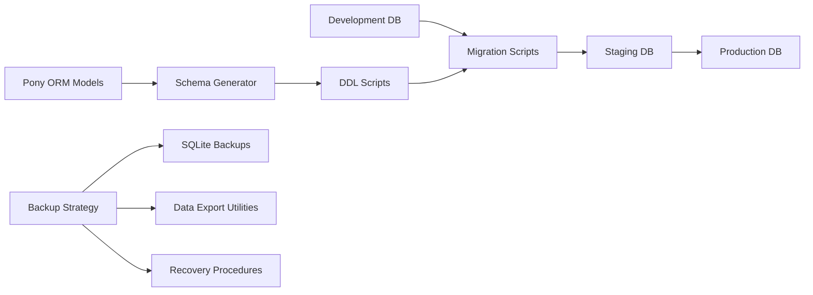

#### **Soft Delete Pattern**
```python
# Konsistente Soft-Delete-Implementation
class AuditableEntity(db.Entity):
    created_at = Required(datetime, default=utcnow_naive)
    last_modified = Required(datetime, default=utcnow_naive)
    prep_delete = Optional(datetime)  # Soft Delete Flag
    
    def soft_delete(self):
        self.prep_delete = utcnow_naive()
        
    @classmethod
    def active_entities(cls):
        return cls.select(lambda e: e.prep_delete is None)
```

### Testing und Quality Assurance

#### **Testing Strategy**
- **Unit Tests:** pytest mit Fixtures für Database Mocking
- **Integration Tests:** Command Pattern Testing
- **GUI Tests:** Qt Test Framework für UI-Validierung
- **Performance Tests:** Solver-Performance für große Datasets
- **Regression Tests:** Automatisierte Test-Suite für CI/CD

#### **Code Quality Tools**
- **Type Checking:** mypy für statische Typenanalyse
- **Linting:** ruff für Code Style Enforcement
- **Coverage:** pytest-cov für Test Coverage Analysis
- **Documentation:** Sphinx für API-Dokumentation

---

## 🏗️ Perspektive 3: Product Manager

### Produktvision und Marktpositionierung

#### **Zielgruppe-Definition**
**Primäre Zielgruppe:** Mittelständische Unternehmen (50-500 Mitarbeiter)
- Service-Unternehmen mit freiberuflichen Mitarbeitern
- Zeitkritische Projektplanung erforderlich
- Komplexe Constraint-Anforderungen (Skills, Standorte, Präferenzen)
- Manuelle Planungstools stoßen an Grenzen

**Sekundäre Zielgruppe:** Große Organisationen mit komplexer Ressourcenplanung
- Consulting-Firmen
- Event-Management-Unternehmen  
- Healthcare-Organisationen mit Schichtplanung
- Bildungseinrichtungen mit Kursplanung

#### **Value Proposition Canvas**
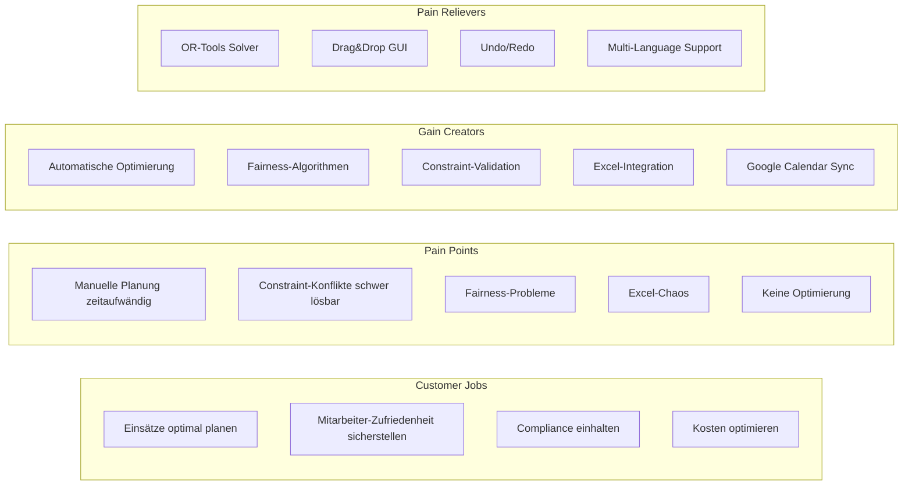

### Feature-Portfolio und Roadmap

#### **Core Features (Production-Ready)**

**1. Automatische Einsatzplanung**
- Constraint-basierte Optimierung mit 20+ Regel-Typen
- Multi-Stage Solving: Feasibility → Optimization → Fairness
- Real-time Constraint-Validation mit User-Feedback
- Alternative Lösungs-Generation bei Konflikten

**2. Mitarbeiter-Management**
- Umfassendes Profil-Management (Skills, Präferenzen, Verfügbarkeiten)
- Role-based Authentication und Authorization
- Team-Zuordnungen mit hierarchischen Strukturen
- Employee-Event-System für Urlaub/Krankheit/Schulungen

**3. Planungsperioden-Management**
- Flexible Planungsperioden (Wochen, Monate, Custom)
- Template-basierte Planerstellung
- Historische Plan-Verwaltung mit Audit-Trail
- Plan-Vergleich und -Analyse

**4. Location und Time Management**
- Multi-Location-Support mit Präferenz-Systemen
- Flexible Arbeitszeit-Definitionen
- Partner-Präferenz-Management
- Standort-Kombinationen und -Beschränkungen

**5. Google Calendar Integration**
- Bidirektionale Synchronisation
- Bulk-Import/Export von Terminen
- Konflikt-Erkennung und -Auflösung
- Automatische Erinnerungs-Setup

**6. Advanced Excel Integration**
- Template-basierte Export-Systeme
- Bulk-Import mit Validation
- Custom Export-Configurations
- Availability-Import von Mitarbeitern

#### **Recently Implemented Features (August 2025)**

**1. Multi-Selection Drag & Drop System** ✅
- Erweiterte TreeWidget-Funktionalität
- Batch-Operations für Gruppenverwaltung  
- Timing-optimierte Implementation für Performance
- Cross-Widget Drag&Drop Support

**2. Comprehensive Help System** ✅
- F1-Context-Sensitive Help für 11 Hauptformulare
- HTML-basierte Hilfedokumentation
- Cross-Reference-System zwischen Help-Topics
- Multi-Language Help-Content

**3. Threading Crash Resolution** ✅
- Robuste Thread-Communication zwischen GUI und Solver
- QWidgetAction Thread-Safety Implementation
- Comprehensive Crash-Logging und -Analysis
- Production-Ready Threading Architecture

#### **Feature Roadmap (Next Quarter)**

**Q4 2025 Priorities:**

**1. Advanced Analytics Dashboard**
- Employment Statistics Expansion
- Chart.js/D3.js Integration für Visualisierungen
- KPI-Dashboards für Management-Reporting
- Predictive Analytics für Planungsoptimierung

**2. API Development**
- REST API für externe Integrationen
- Webhook-Support für real-time Updates
- Mobile App Support (API-first)
- Third-Party-Integration-Framework

**3. Enterprise Features**
- Multi-Tenant-Architektur
- Advanced User Management
- Audit-Logging und Compliance-Reporting
- Backup und Recovery-Automatisierung

**4. UX/UI Improvements**
- Modern UI-Redesign mit aktuellen Design-Trends
- Accessibility-Verbesserungen (WCAG 2.1)
- Mobile-Responsive Web-Interface
- Advanced Search und Filter-Capabilities

### User Experience und Interface Design

#### **Current UX Strengths**
- **Dark Mode Integration:** Automatische Erkennung von System-Präferenzen
- **Internationalization:** Vollständige Deutsch/Englisch-Unterstützung
- **Context-Sensitive Help:** F1-Integration für alle Hauptfunktionen
- **Keyboard Shortcuts:** Umfangreiche Tastatur-Navigation
- **Undo/Redo:** System-weite Undo/Redo-Funktionalität

#### **UX-Pain-Points (Improvement Areas)**
- **Learning Curve:** Komplexe Constraint-Konfiguration für neue Benutzer
- **Performance Feedback:** Längere Solver-Läufe ohne Progress-Feedback
- **Mobile Access:** Desktop-only Limitierung
- **Batch Operations:** Nicht alle Operationen unterstützen Multi-Selection

### Business Logic und Workflow

#### **Haupt-Business-Workflows**

**1. Planungserstellungs-Workflow**
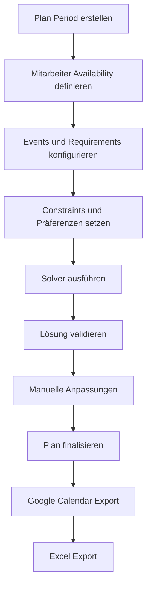

**2. Mitarbeiter-Onboarding-Workflow**
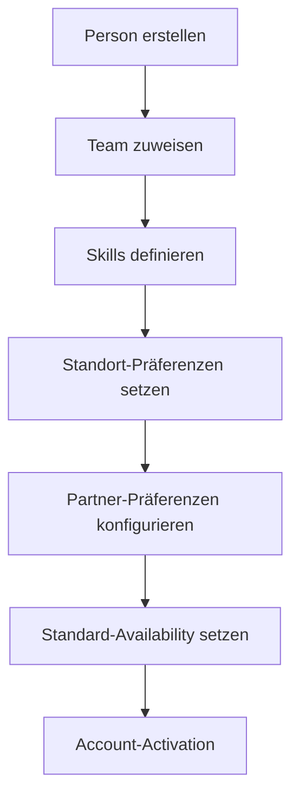

**3. Konfliktauflösungs-Workflow**
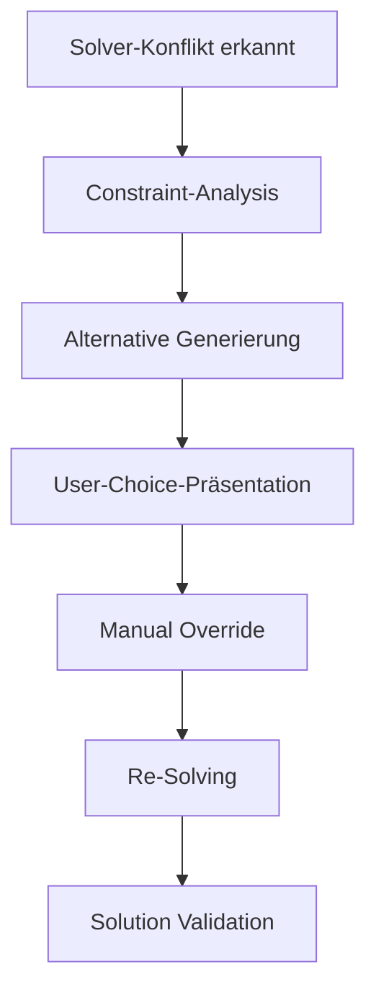

### KPIs und Success Metrics

#### **Operational KPIs**
- **Planning Efficiency:** Zeit pro Plan-Erstellung (Target: <30 min)
- **Solver Success Rate:** Lösbare Pläne (Target: >95%)
- **Constraint Satisfaction:** Erfüllte Präferenzen (Target: >80%)
- **User Adoption:** Aktive Nutzer pro Woche
- **System Uptime:** Verfügbarkeit (Target: >99.5%)

#### **Business KPIs**
- **Planning Accuracy:** Tatsächlich durchgeführte vs. geplante Einsätze
- **Employee Satisfaction:** Zufriedenheit mit Planungen (Survey)
- **Cost Reduction:** Reduzierte Planungskosten vs. manuelle Planung
- **Time Savings:** Gesparte Stunden pro Planungszyklus

#### **Technical KPIs**
- **Bug Rate:** Bugs pro Feature (Target: <0.1)
- **Response Time:** GUI Response-Zeiten (Target: <200ms)
- **Solver Performance:** Lösungszeit für Standard-Probleme (Target: <2min)
- **Memory Usage:** Speicherverbrauch bei großen Datasets

### Competitive Analysis

#### **Wettbewerbsvorteile**
1. **OR-Tools Integration:** Einzigartige Constraint-Programming-Capabilities
2. **Comprehensive Domain Model:** Abbildung aller Planungs-Komplexitäten
3. **German Market Focus:** Deutsche Lokalisierung und Compliance
4. **Desktop-First Approach:** Native Performance vs. Web-Apps
5. **Open Architecture:** Erweiterbar und anpassbar

#### **Market Gaps Being Addressed**
- **Complexity Handling:** Bestehende Tools zu simpel für echte Planungsherausforderungen
- **Fairness Focus:** Algorithmic Fairness als Kernfeature
- **Integration Depth:** Tiefe Integration aller Planungsaspekte
- **Customization:** Hochflexible Constraint-Konfiguration

### Compliance und Regulatory Considerations

#### **GDPR Compliance**
- Datenschutz-konforme Speicherung von Mitarbeiterdaten
- Right-to-be-Forgotten Implementation (Soft Delete)
- Audit-Trail für alle Datenänderungen
- Opt-in/Opt-out für Google Calendar Integration

#### **Labor Law Compliance (Germany)**
- Arbeitszeit-Überwachung und -Limitierung
- Ruhezeiten-Enforcement
- Urlaubsplanung Integration
- Dokumentation für Arbeitsschutz-Audits

---

## 🔧 Technische Spezifikationen

### System Requirements

#### **Minimum Requirements**
- **OS:** Windows 10/11, macOS 10.15+, Ubuntu 20.04+
- **Python:** 3.12+
- **RAM:** 4GB (8GB empfohlen)
- **Storage:** 500MB Basis-Installation + Data
- **Network:** Internet-Zugang für Google Calendar Integration

#### **Recommended Setup**
- **RAM:** 16GB für große Datasets (>1000 Mitarbeiter)
- **CPU:** Multi-Core für Solver-Performance
- **SSD:** Für Database-Performance
- **Network:** Stabile Verbindung für Cloud-Features

### Deployment Architecture

#### **Current: Desktop Application**
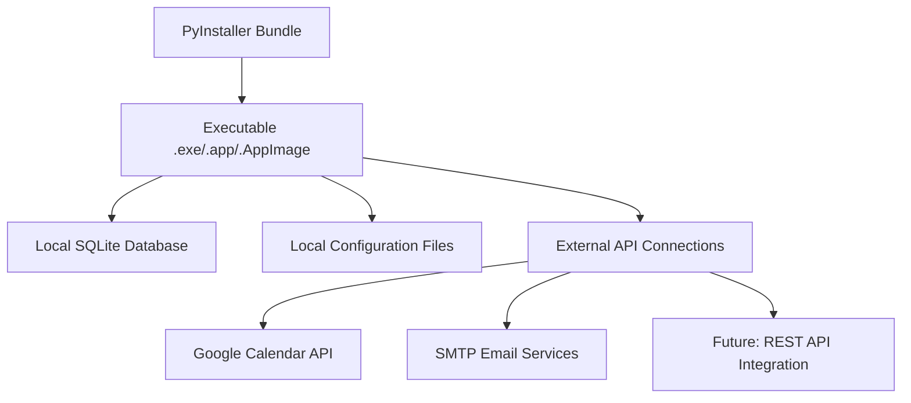

#### **Future: Hybrid Architecture**
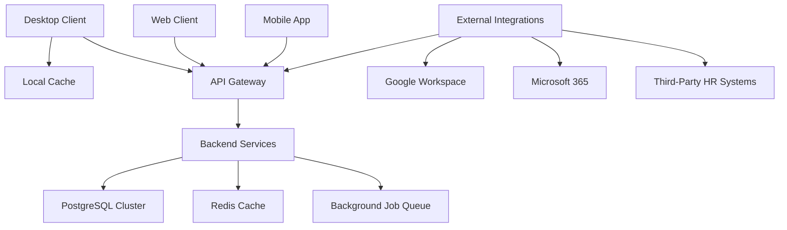

### Performance Specifications

#### **Solver Performance Targets**
- **Small Problems** (≤50 Mitarbeiter, ≤100 Events): <30 Sekunden
- **Medium Problems** (≤200 Mitarbeiter, ≤500 Events): <5 Minuten  
- **Large Problems** (≤500 Mitarbeiter, ≤1000 Events): <15 Minuten
- **Enterprise Problems** (>500 Mitarbeiter): Staged Solving mit Progress-Feedback

#### **GUI Performance Targets**
- **Startup Time:** <5 Sekunden
- **Form Load Time:** <1 Sekunde
- **Tree Widget Operations:** <100ms für Standard-Operations
- **Database Operations:** <200ms für CRUD Operations

### Security Architecture

#### **Authentication Flow**
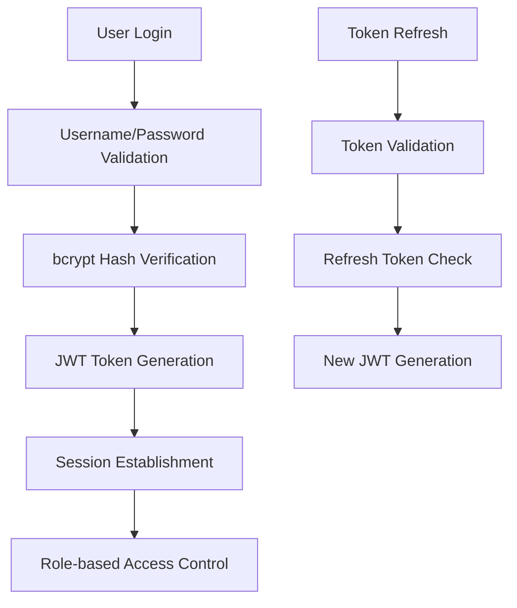

#### **Data Security Measures**
- **Encryption at Rest:** Database-Encryption für sensitive Daten
- **Encryption in Transit:** HTTPS für alle API-Kommunikation
- **Access Control:** Granulare Permissions pro Feature
- **Audit Trail:** Vollständige Logging aller Datenänderungen

---

## 📊 Datenmodell-Spezifikation

### Kern-Business-Entities

#### **Hierarchie der Hauptentitäten**
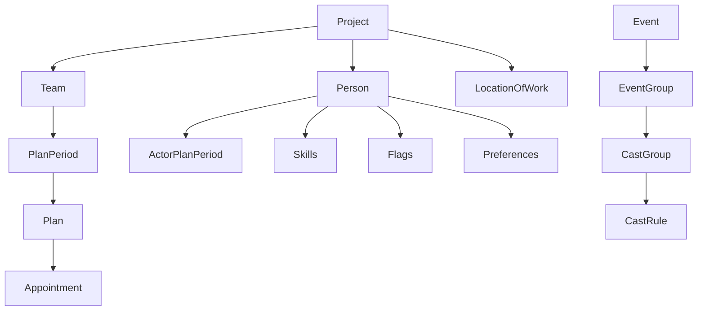

#### **Constraint-Modeling-Entities**
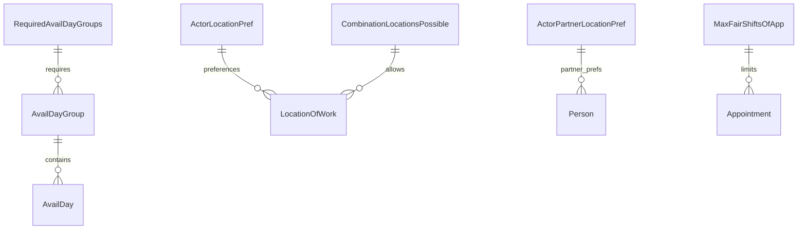

### Entity Relationships Deep-Dive

#### **Person Entity (Mitarbeiter-Modell)**
```python
# Kernfelder
- id: UUID (Primary Key)
- f_name, l_name: str (Composite Key mit Project)
- role: Role (Admin, Dispatcher, Actor)
- email, username: str (Unique Identifiers)
- requested_assignments: int (Wunsch-Einsätze pro Period)

# Beziehungen (High-Cardinality)
- team_actor_assigns: Set[TeamActorAssign] (Historische Team-Zuordnungen)
- actor_plan_periods: Set[ActorPlanPeriod] (Verfügbarkeiten pro Period)
- skills: Set[Skill] (Qualifikationen)
- flags: Set[Flag] (Status-Marker)
- employee_events: Set[EmployeeEvent] (Urlaub, Krankheit, etc.)

# Präferenz-Modellierung  
- actor_location_prefs: Set[ActorLocationPref] (Standort-Präferenzen)
- actor_partner_location_prefs: Set[ActorPartnerLocationPref] (Partner-Präferenzen)
```

#### **Plan Entity (Planungs-Ergebnis)**
```python
# Planungsmetadata
- name: str (User-definiert)
- plan_period: PlanPeriod (Zeitraum-Referenz)
- location_columns: JSON (Spalten-Layout für Excel-Export)

# Generated Content
- appointments: Set[Appointment] (Solver-generierte Termine)
- excel_export_settings: ExcelExportSettings (Export-Konfiguration)
```

### Data Flow Architecture

#### **Planungsdatenfluss**
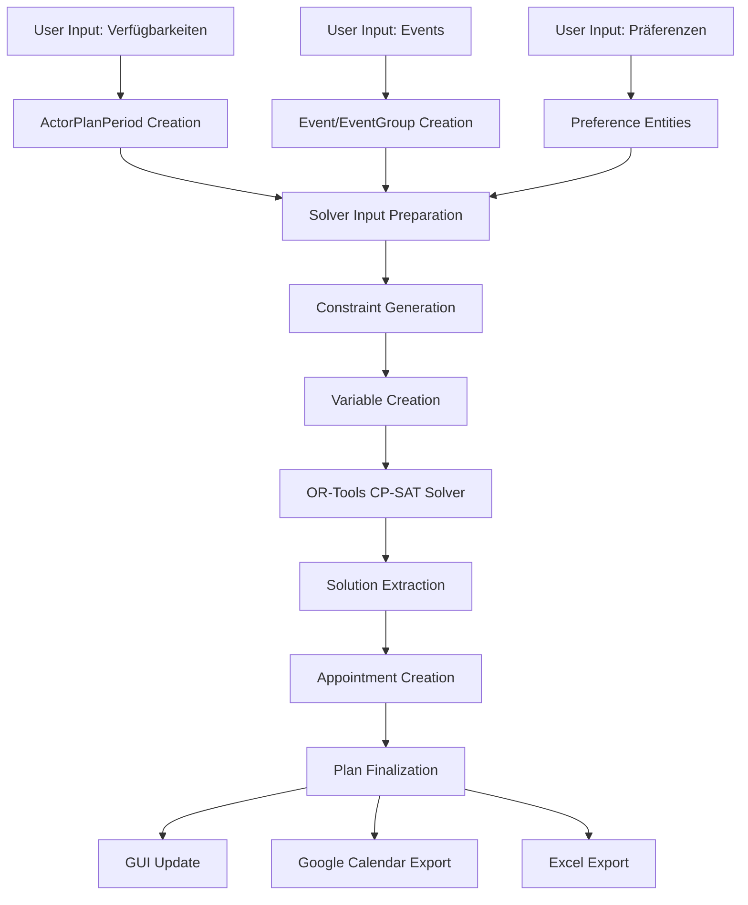

---

## 🚀 Implementation Status und Next Steps

### Aktuelle Implementierung (August 2025)

#### **Production-Ready Components** ✅
- **Core Planning Engine:** Vollständig implementiert und getestet
- **GUI Infrastructure:** 30+ Formulare mit vollständiger Funktionalität
- **Database Layer:** Umfassendes Entity-Model mit 25+ Tabellen
- **Command System:** Undo/Redo für alle kritischen Operationen
- **Help System:** Context-sensitive F1-Help für 11 Hauptformulare
- **Multi-Selection:** Advanced Drag&Drop für Tree-Widgets
- **Threading:** Robuste Thread-Communication zwischen GUI und Solver

#### **Quality Assurance Status** ✅
- **Testing:** pytest-Suite mit Database-Fixtures
- **Type Safety:** mypy-konform mit vollständigen Type Hints
- **Documentation:** Umfassende Memory-Dokumentation für alle Features
- **Logging:** Production-Grade Logging mit Crash-Analysis
- **Error Handling:** Comprehensive Exception-Handling-Strategy

### Critical Success Factors

#### **Technical Excellence**
1. **Maintainability:** Code-Qualität und Dokumentation auf höchstem Niveau
2. **Performance:** Solver-Optimierung für Enterprise-Scale-Probleme
3. **Reliability:** Zero-Downtime-Deployment und Robust Error Recovery
4. **Security:** Enterprise-Grade Security und Compliance

#### **Product Excellence**  
1. **User Experience:** Intuitive GUI mit minimaler Learning-Curve
2. **Feature Completeness:** Abdeckung aller kritischen Planungsszenarien
3. **Integration Depth:** Nahtlose Integration in bestehende Workflows
4. **Scalability:** Support für Unternehmenswachstum

#### **Business Excellence**
1. **Market Fit:** Lösung echter Geschäftsprobleme mit messbarem ROI
2. **Competitive Advantage:** Technologische Überlegenheit in Constraint-Solving
3. **Customer Success:** Hohe User-Adoption und -Satisfaction
4. **Revenue Growth:** Skalierbare Licensing und Support-Modelle

---

## 📈 Fazit und Ausblick

### Projekt-Assessment (Software-Architekt-Sicht)
HCC Plan DB Playground demonstriert **herausragende Software-Architektur** mit durchdachten Design-Patterns, robuster Multi-Threading-Implementation und state-of-the-art Constraint-Programming-Integration. Die Kombination aus Pony ORM, PySide6 und OR-Tools bietet eine solide technische Foundation für Enterprise-Deployment.

### Code-Quality-Assessment (Developer-Sicht)  
Das Projekt zeigt **außergewöhnliche Code-Qualität** mit konsequenten Type Hints, umfassendem Command Pattern, und robuster Error-Handling-Strategy. Die modulare Architektur mit klarer Separation of Concerns ermöglicht effiziente Wartung und Erweiterung.

### Product-Assessment (Product-Manager-Sicht)
Das Produkt adressiert einen **klaren Market Need** mit technologisch überlegener Lösung. Die Kombination aus automatisierter Optimierung, benutzerfreundlicher GUI und umfassender Integration bietet signifikanten Wettbewerbsvorteil. Das Feature-Set ist **market-ready** mit klarer Roadmap für Expansion.

### Strategische Empfehlungen

#### **Kurzfristig (Q4 2025)**
1. **API-Development** für Mobile-Access und Third-Party-Integration
2. **Advanced Analytics** für Business Intelligence
3. **UX-Refinement** basierend auf User-Feedback
4. **Performance-Optimization** für Large-Scale-Deployments

#### **Mittelfristig (2026)**
1. **Cloud-Native-Migration** für SaaS-Offering
2. **Machine Learning Integration** für Predictive Planning
3. **Advanced Compliance Features** für regulierte Industrien
4. **Ecosystem-Expansion** mit Partner-Integrationen

#### **Langfristig (2027+)**
1. **AI-Powered Planning Assistant** mit Natural Language Interface
2. **Industry-Specific Modules** für Healthcare, Education, Consulting
3. **Global Market Expansion** mit Multi-Currency und Local-Compliance
4. **Platform Strategy** als Planungs-Platform für Drittanbieter

---

**Dokumenterstellung:** 24. August 2025  
**Nächste Review:** Q4 2025  
**Verantwortlich:** Thomas Bomblies, HCC Development Team